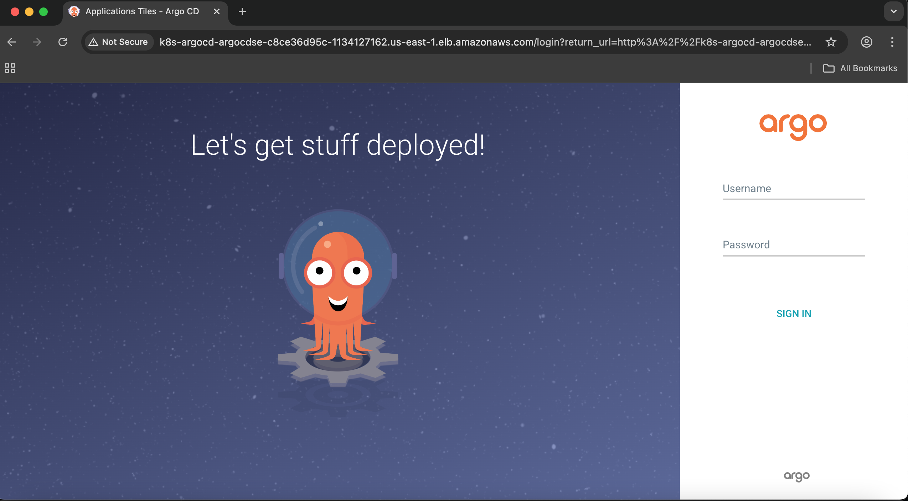
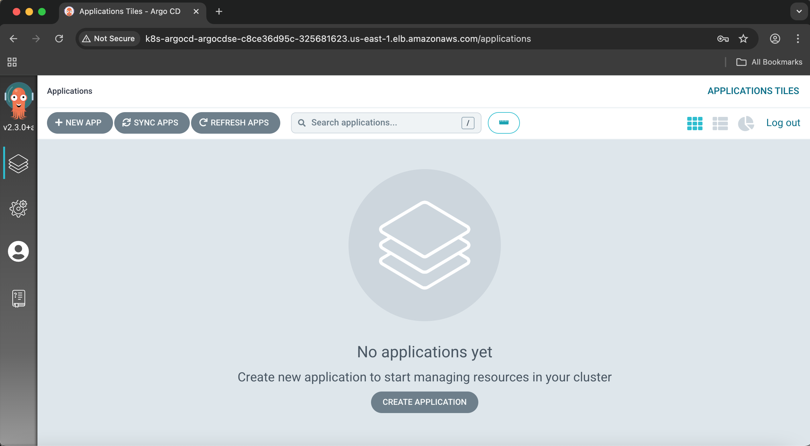

# Infra-ArgoCD-EKS-AWS

In this demo, I will deploy argocd with redis and pvc on EKS， this is for the Infrastruce of your deployment management

## Features

- Argocd server pods running on EKS
- redis running for Application state cache and fast API request 
- ALB for a internet face access


## Usage

- you will get the initial output password from your github action output

- Install argocd cli on ubuntu:
```shell
curl -sSL -o argocd-linux-amd64 https://github.com/argoproj/argo-cd/releases/latest/download/argocd-linux-amd64
```
grant the priviledge
```shell
sudo install -m 555 argocd-linux-amd64 /usr/local/bin/argocd
```
check the version
```shell
argocd version --client
```
- Change the password using argocd cli

   On your terminal
```shell
kubectl port-forward -n argocd svc/argocd-server 8080:80
```
```shell
argocd login localhost:8080 --username admin --password lL5vEtK-uxyLoEwI --insecure
```
```shell
argocd account update-password
```

## Reference

- ArgoCD Login Page



- ArgoCD Dashboard
